# Lecture 1

## Event Sourcing

## Linearization

### Linearizability

- Helps understanding CAP theorem
- Used in analysis of competitive systems

### Histories

- FIFO

- enqueue(x) : add x to the end of the queue
- dequeue(x) : remove x from the beginning of the queue

- History — finite sequence of the operations. The one single execution of some code is a history.

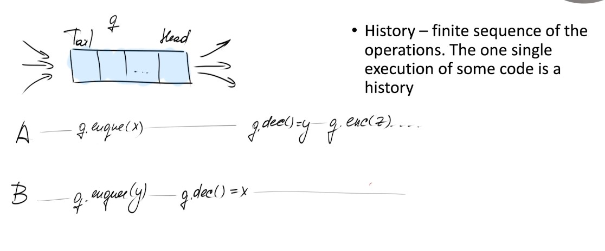
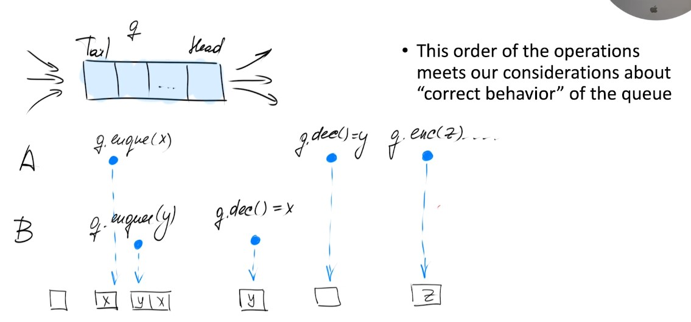

### Sequential specification

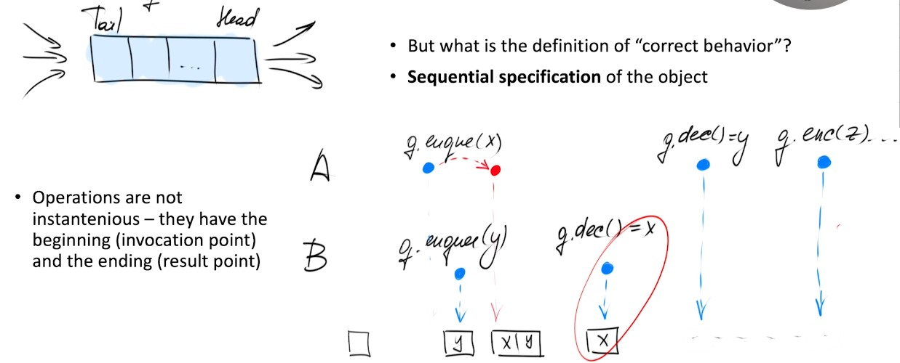

- Circled in red in the photo is not possible, we need to dequeue Y before X.

- Beginning moment - invocation of the first operation
- Result moment - end of the last operation

### Happens-before

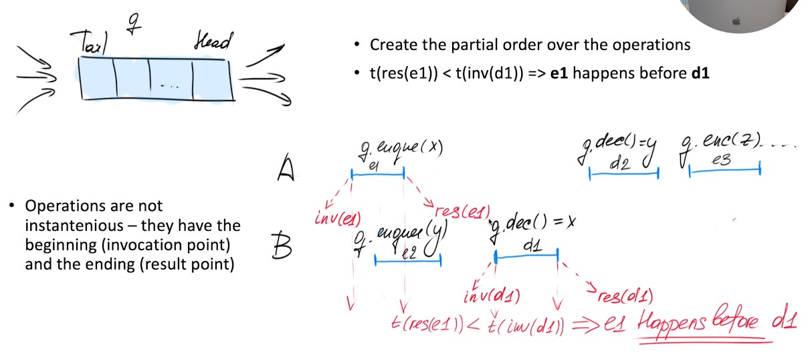

### Parallel operations

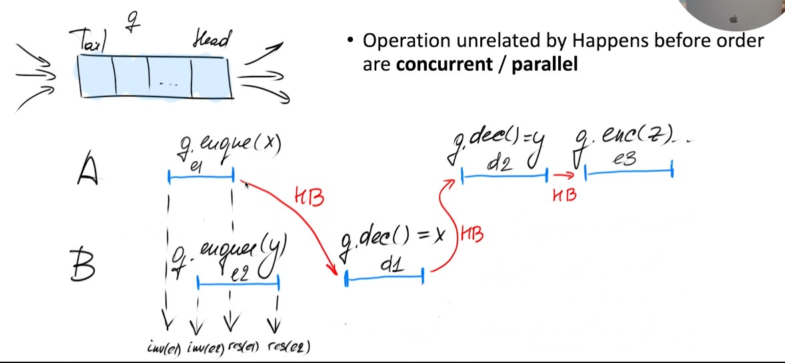

### Sequential histories
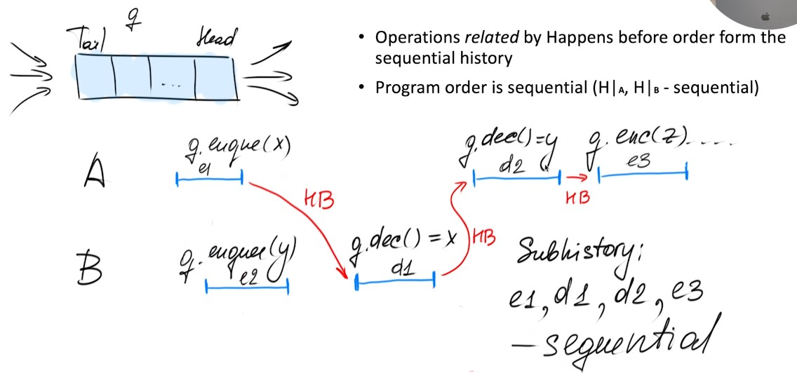

- All operations happened sequentially, not just in one thread.

### Linearizability

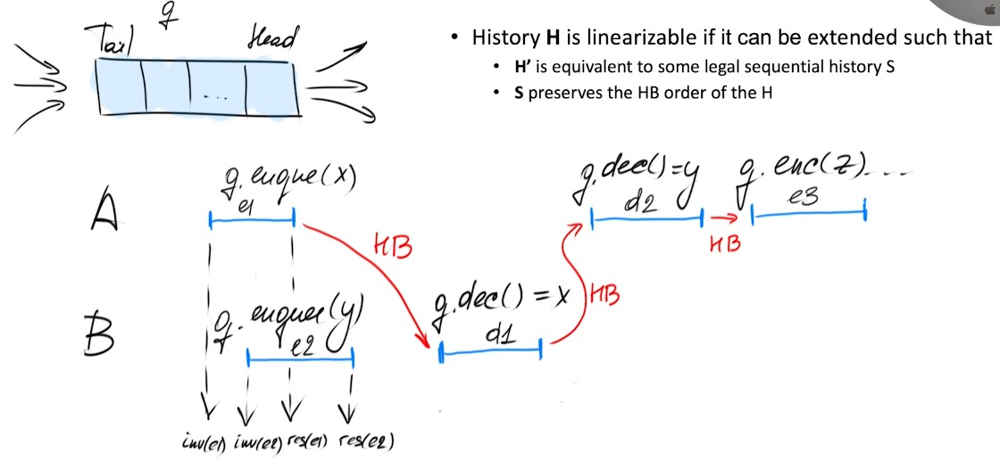

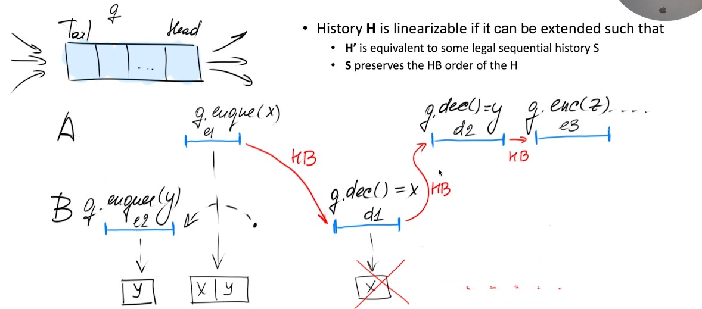

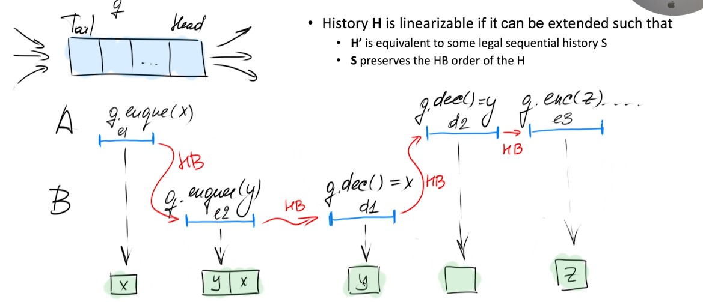

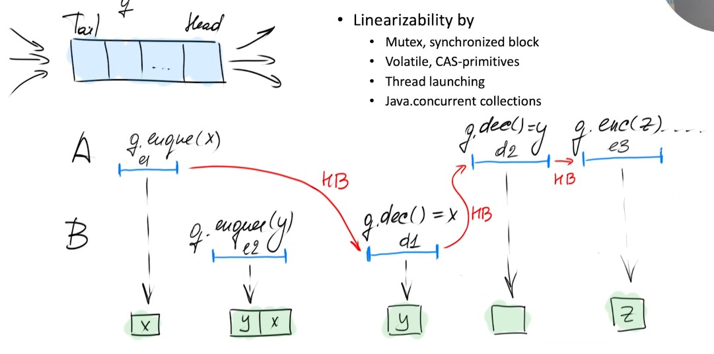

### Interesting fact

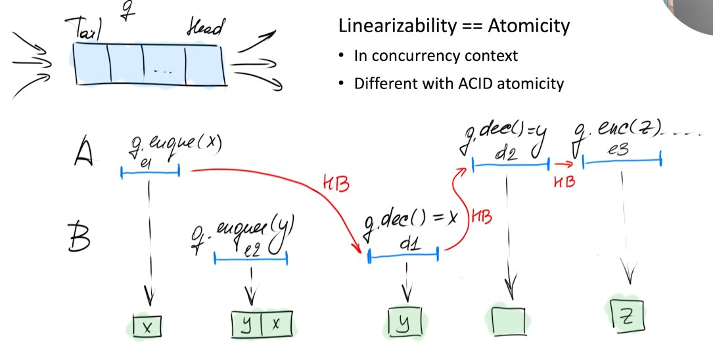

- Atomicity here is not the same atomocity as in ACID.

- Linearizability is one of the guarantess in parallel programming (The strongest).

## CAP-Theorem

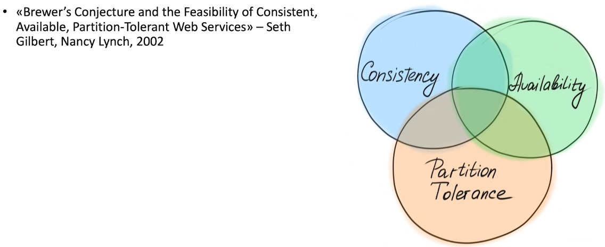

- 3 Properties: Consistency, Availability, Partition Tolerance

- Brewer's theorem: It is impossible to have all 3 properties at the same time. (2 out of 3)

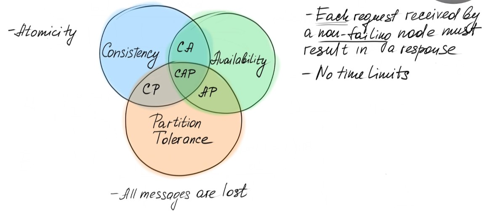

- Consistency: All nodes see the same data at the same time.

- Availability: Every request receives a response.

- Partition Tolerance: The system continues to operate despite an arbitrary number of messages being dropped (or delayed) by the network between nodes.

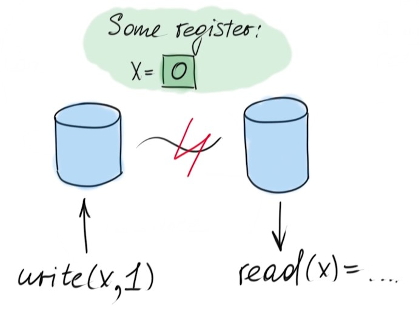

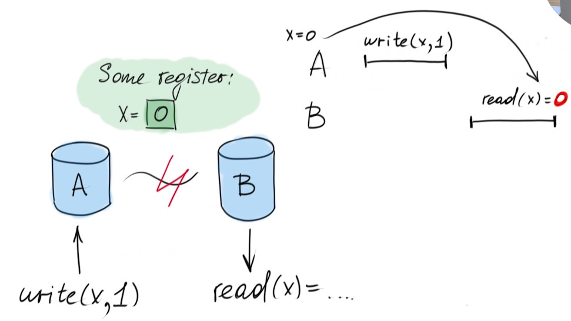

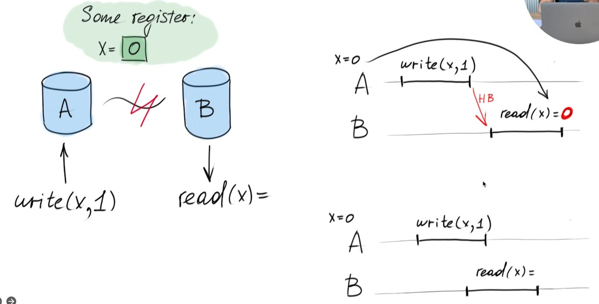

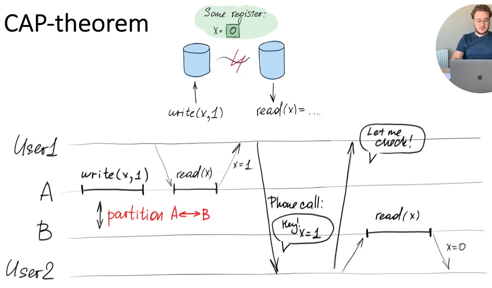

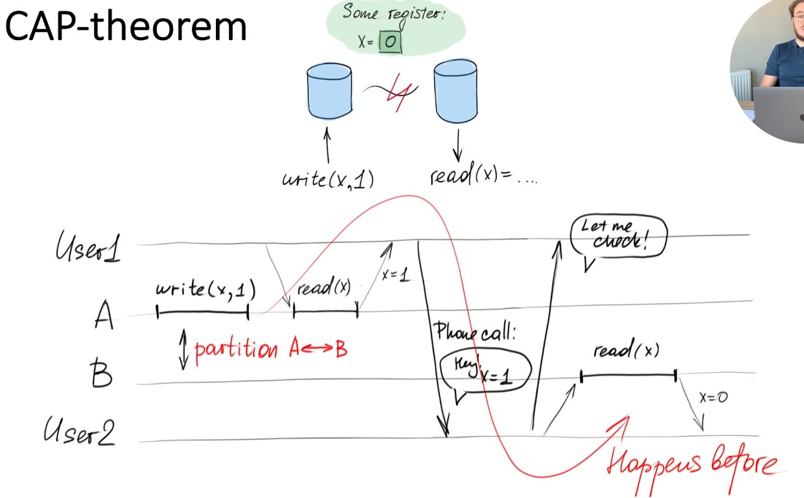